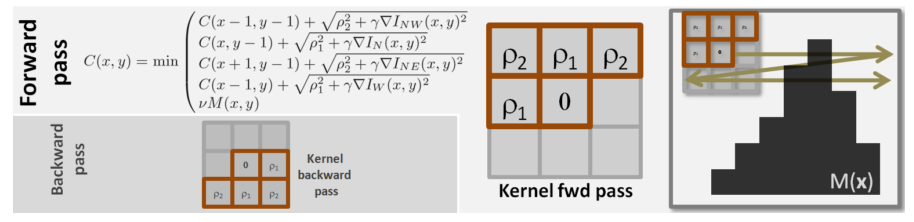
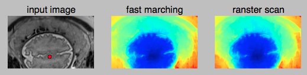

# Implementation of geodesic distance transforms for 2D and 3D images
Geodesic transformation of images can be implementated with two approaches: fast marching and raster scan. Fast marching is based on the iterative propagation of a pixel front with velocity F [1]. Raster scan is based on kernel operations that are sequentially applied over the image in multiple passes [2]. In GeoS [3], the authors proposed to use a 3x3 kernel for forward and backward passes for efficient geodesic distance transform, which was used for image segmentation.

Raster scan for geodesic distance transform. Image from [3].

DeepIGeoS [4] proposed to combine geodesic distance transforms with convolutional neural networks for efficient interactive segmentation of 2D and 3D images. 

* [1] Sethian, James A. "Fast marching methods." SIAM review 41, no. 2 (1999): 199-235.
* [2] Borgefors, Gunilla. "Distance transformations in digital images." CVPR, 1986
* [3] Criminisi, Antonio, Toby Sharp, and Andrew Blake. "Geos: Geodesic image segmentation." ECCV, 2008.
* [4] Wang, Guotai, et al. "Deepigeos: A deep interactive geodesic framework for medical image segmentation." arXiv preprint arXiv:1707.00652 (2017). https://arxiv.org/abs/1707.00652

A comparison of fast marching and ranster scan for 2D geodesic distance transform.
